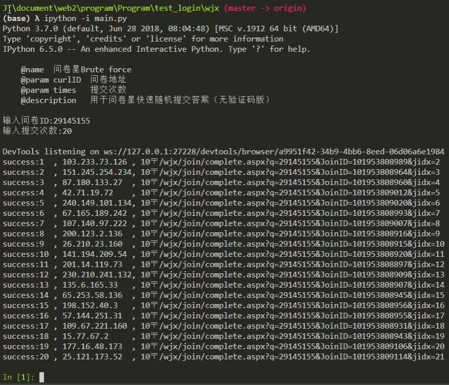
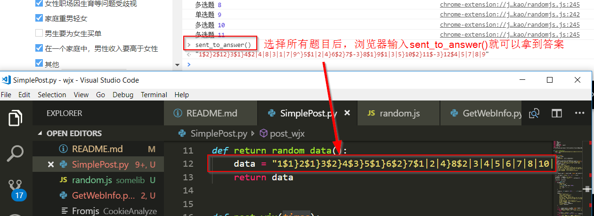

# 问卷星自动随机答题---不支持验证码

- 如果有验证码请重新复制一份答卷

## 已适配题型

### 表格

- 单选
- 多选

### 普通

- 单选
- 多选
- 星星
- 下拉
- 拉条
- 填空 自动留白
- 排序
- 图片

# 一, 随机快速提交版 `main.py` [推荐]

## 安装依赖包

```python
pip install selenium re
```

## python完成selenium的安装还需要chromewebdriver.exe的支持

安装chromewebdriver.exe的方法请点击[这里](https://github.com/tignioj/test_login/tree/master/zhs#%E4%BA%8C%E7%AB%A0%E8%8A%82%E6%B5%8B%E8%AF%95%E8%87%AA%E5%8A%A8%E6%8F%90%E4%BA%A4)

```python
git clong https://github.com/tignioj/test_login.git  # 拉取项目到本地
cd test_login/wjx  # 进入问卷星目录
python main.py     # 执行main.py,此处也可以输入ipython main.py
>>> 请输入问卷ID    # 输入问卷ID
>>> 输入提交次数    # 输入提交的次数
```

## 成功截图



# 二, 非随机快速提交版本 `SimplePost.py`

## 1.编辑代码，修改`return_random_data()`里面的`data`

- Notice1: 为什么命名为return_random_data呢？因为对于单道题完全可以手动写一个随机的答案，由于不同的问卷随机答案不一样，因此不具有普适性
- Notice2: 此版本不需要安装selenium



## 2. 执行`python SimplePost.py`

其余步骤类似于main.py

# 三, 问卷星自动随机答题---单次提交版

- 用于问卷星自动随机选择并提交，若有验证码需要手动输入验证码
- 测试环境 Chrome broswer Version 69.0.3497.92 (Official Build) (64-bit)

# 用法

用谷歌浏览器打开题目的网址，按下F12,找到console窗口，复制`randomjs.js`中的所有代码到该窗口，回车即可提交


- 如果只选择而不提交，去掉最后一行代码`$("#submit_button").click();`  


# 安装单次提交版本插件到谷歌浏览器

其实这个是个人拿来方便生成随机答案的

## 1. 保存文件到本地

`git clone https://github.com/tignioj/test_login.git`

## 2. 打开谷歌浏览器开发者模式


## 3. 复制chrome_extension_wjx 完整路径到框中


安装成功后，右上角会多处一个问卷星的logo!

## 4. 只要打开问卷地址，就会自动选择

## 5. 重选只要打开问卷地址，点击右上角的问卷星logo

