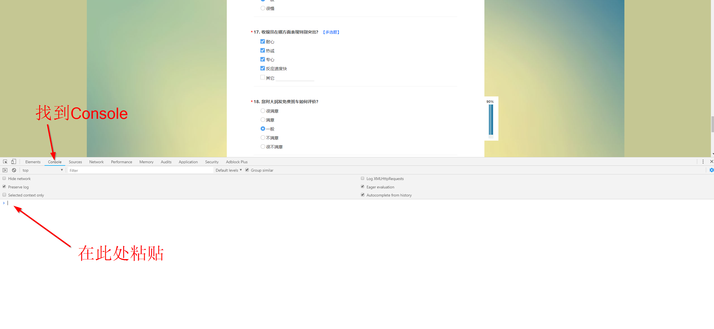
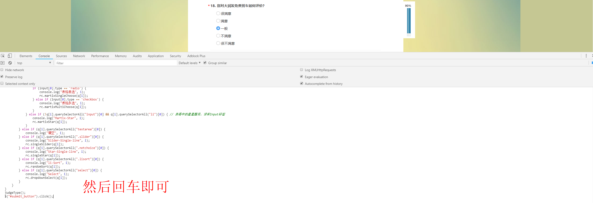
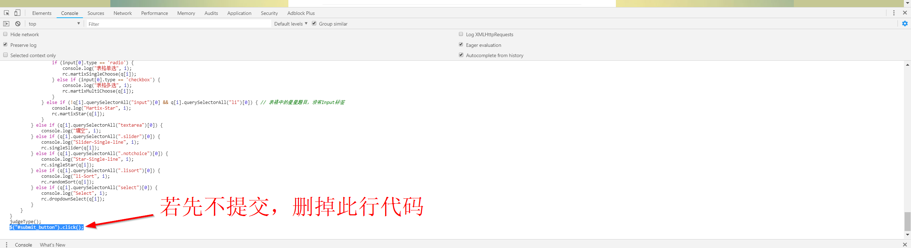
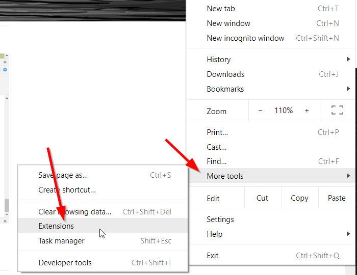
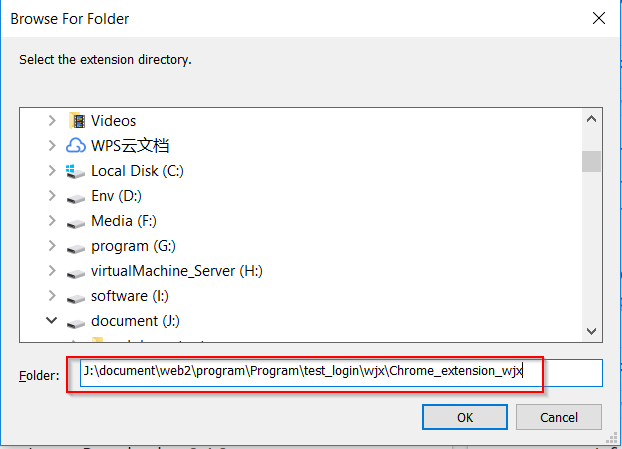
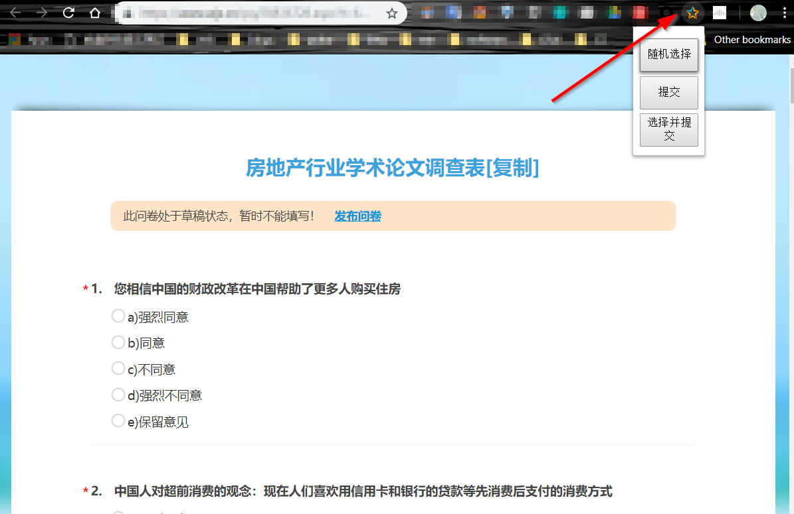

# 问卷星自动随机答题并提交
用于问卷星自动随机选择并提交，若有验证码需要手动输入验证码
# 测试环境
Chrome broswer Version 69.0.3497.92 (Official Build) (64-bit)
# 用法
用谷歌浏览器打开题目的网址，按下F12,找到console窗口，复制`randomjs.js`中的所有代码到该窗口，回车即可提交

# Notice
如果只选择而不提交，去掉最后一行代码`$("#submit_button").click();`  

## 已适配题型
 

#### 表格
 - 单选
  - 多选
#### 普通
 - 单选
 - 多选
 - 星星
 - 下拉
 - 拉条 
 - 填空 自动留白
 - 排序
 - 图片

# 安装到谷歌浏览器插件
#### 1. 保存文件到本地
`git clone https://github.com/tignioj/test_login.git`
#### 2. 打开谷歌浏览器开发者模式

#### 3. 复制chrome_extension_wjx 完整路径到框中

安装成功后，右上角会多处一个问卷星的logo!
#### 4. 打开问卷地址，点击logo，选择即可
