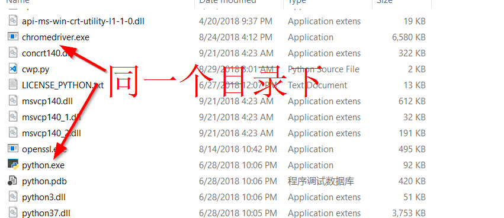
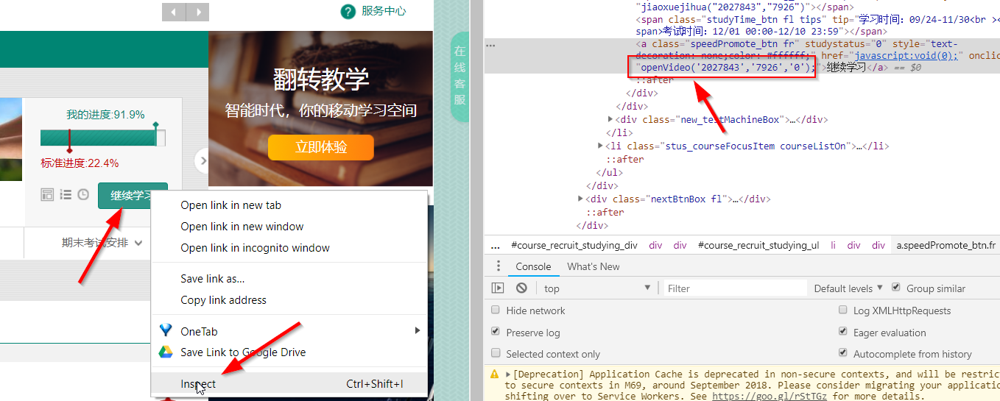
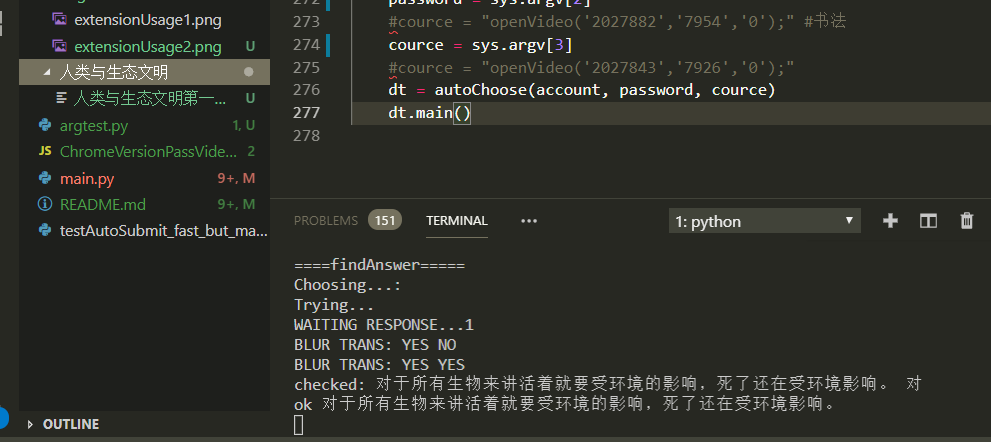

# 智慧树 
用智慧树刷课，python章节测试提交
# 注：仅供学习交流，请勿用于商业用途，使用后果自行承担

# 一，刷视频
`ChromeVersionPassVideo.js`里面的内容直接粘贴到谷歌浏览器控制台
- 1.打开视频，点击播放
- 2.按键盘F12打开Chrome浏览器控制台
- 3.找到console窗口，复制代码到窗口，粘贴回车
#### 已实现的功能:
- 自动下一集
- 自动1.5倍速
- 自动填写弹窗
- 静音播放
  

# 安装刷课插件到谷歌浏览器
安装方法请参考[问卷星插件的安装方法](https://github.com/tignioj/test_login/blob/master/wjx/README.md)
  
 - `SpeedUP ` 完成上述实现功能
 - `Restore` 清除上述功能
 - `Enable RightClick` 在章节测试中可以复制题目、右键

# 二，章节测试自动提交
### 前期准备
- `main.py`用于课后章节测试需要selenium，wxpy模块和webdriver.exe，且需要python3,答案来源于某些微信公众号
#### 1. 安装[python3](https://www.python.org/)
#### 2. 官网下载[Chromewebdriver.exe](http://chromedriver.chromium.org/downloads)
解压后把`chromedriver.exe`放在python3的安装目录

#### 3. 安装必要的模块
pip3 install selenium re wxpy
#### 4. 关注可以查答案的公众号,此处以"校查"为例
非利益关系，完成答题后，如不需要请自行取关
#### 5. 三个必要的参数
- account  智慧树账户（暂时只能手机号登陆)
- password  智慧树密码
- course  课程id （右键检查即可获取课程id）

### 开始动手
确保前期准备充分后，开始动手
#### 1.拉取文件
`git clone https://github.com/tignioj/test_login.git`
#### 2.进入zhs目录
`cd test_login/zhs`
#### 3.执行`python 你的手机号  你的密码  课程id`

举例 `python 12345678900 abcabc  "openVideo('2027843','7926','0');"`  
#### 4.如果不出错，那么此时应该弹出一个微信登陆的二维码，扫描并登陆
 - 此步进行前确保已经关注微信公众号"校查"
 - 微信新账号是无法登陆的，如果无法登陆，请换个旧号
 - 登陆成功后，应该自动弹出谷歌浏览器
#### 5.登陆后，在手机上可以看到微信不断向公众号"校查"发送题目
坐等，完毕后，本地目录会多一个答案的文件夹

#### 6.注意
为了保险，默认只选择选型而不提交，确认答案之后，自行手动提交即可

# TODO
- [ ] 增加学号登陆

# 如果对你有帮助，请给个star ^^支持一下
# 有问题欢迎开issue（国际惯例，请先百度谷歌）